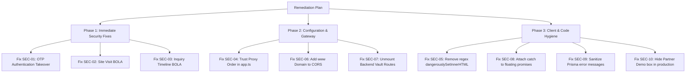

# Vilaasa Estates — Comprehensive Vulnerability & Bug Audit Report

**Date:** 5 September 2026  
**Repository:** `eyeleveltech/Vilaasa-Estate`  
**Branch:** `naif`  
**Target Environment:** Production (`https://www.vilaasaestates.com`) & Staging  
**Scope:** Entire Codebase — Backend (Node.js, Express, Prisma, PostgreSQL), Frontend (React, Vite, Tailwind), API Gateway, Authentication & Authorization, Data Protection.

---

## Executive Summary

Following the remediation of the initial UI/UX defects, an end-to-end security and vulnerability audit was conducted across the backend services, database layer, public client, and internal portals (Super Admin & Channel Partner).

The audit identified **11 findings** spanning authentication logic, authorization boundaries (BOLA/IDOR), reverse proxy configurations, client-side rendering safety, and error disclosures.

### Summary Table

| Severity | Count | Category | Key Finding |
| :--- | :---: | :--- | :--- |
| **🔴 Critical (P0)** | 1 | Authentication Bypass / Privilege Escalation | Account Takeover via SMS/Email OTP parameter discrepancy |
| **🟠 High (P1)** | 2 | Broken Object-Level Authorization (BOLA/IDOR) | Unauthorized cross-partner mutation and inquiry inspection |
| **🟡 Medium (P2)** | 4 | Security Misconfiguration & Client Safety | Rate limiter reverse proxy trust, Regex XSS, CORS omission, Dead Vault endpoints |
| **🟢 Low (P3)** | 4 | Robustness & Hygiene | Unhandled async promise rejections, Prisma schema leak, Demo credentials, Dependency CVEs |

---

# 🔴 Critical Severity

## SEC-01: Complete Account Takeover via SMS/Email OTP Discrepancy

* **CWE:** [CWE-287: Improper Authentication](https://cwe.mitre.org/data/definitions/287.html), [CWE-304: Missing Critical Step in Authentication](https://cwe.mitre.org/data/definitions/304.html)
* **CVSS v3.1 Score:** **9.8 (Critical)** — `CVSS:3.1/AV:N/AC:L/PR:N/UI:N/S:U/C:H/I:H/A:H`
* **Affected File:** [`backend/src/modules/auth/auth.controller.ts:280-413`](file:///d:/EyeLevel/eyelevel%20intern/villasa/backend/src/modules/auth/auth.controller.ts#L280-L413)

### Mechanism of the Vulnerability

The application supports OTP authentication for both phone numbers (via SMS) and email addresses.

1. In `sendOtp`, a user requests an OTP for a phone number (`channel = "SMS"`). An `otpRecord` is created containing the generated OTP code and `phone`.
2. In `verifyOtp`, the search condition is dynamically constructed:
   ```ts
   // backend/src/modules/auth/auth.controller.ts:296-298
   if (channel === "SMS" && normalizedPhone) {
     searchConditions.push({ phone: normalizedPhone });
   } else if (channel === "EMAIL" && normalizedEmail) {
     searchConditions.push({ email: normalizedEmail });
   }
   ```
   When `channel === "SMS"` and `phone` is provided, the database checks **only** that `phone` matches a valid, unexpired `otpRecord`.
3. If an attacker passes their own valid phone and OTP, but *also* provides an arbitrary `email` parameter (e.g. `admin@vilaasaestates.com`):
   ```json
   {
     "channel": "SMS",
     "phone": "+919999999999",
     "email": "admin@vilaasaestates.com",
     "otp": "123456"
   }
   ```
   The query succeeds because the attacker entered the correct OTP sent to their own phone.
4. The controller then executes line 363 to determine the target account:
   ```ts
   // backend/src/modules/auth/auth.controller.ts:363-371
   const targetEmail =
     normalizedEmail ||
     record.email ||
     `vip-${(normalizedPhone || record.phone || "user").replace(/\D/g, "")}@vilaasa.internal`;

   let user = await prisma.user.findUnique({
     where: { email: targetEmail },
   });
   ```
   Because `normalizedEmail` is prioritized over the record, `targetEmail` resolves to `admin@vilaasaestates.com`.
5. The backend retrieves the existing Super Admin account and issues a valid JWT token:
   ```ts
   const token = generateToken(user.id, user.email, user.role);
   ```
   The attacker receives a bearer token granting full `SUPER_ADMIN` privileges without supplying any admin credentials.

### Impact
Any unauthenticated actor can take over arbitrary user and admin accounts by pairing their own verified phone number with any known email address.

### Required Remediation
1. **Strict Channel Isolation:** If `channel === "SMS"`, look up the user **strictly by phone number**. Never allow an arbitrary `email` payload in an SMS verification request to override identity.
2. **Contact Binding:** If both email and phone are provided, assert that `user.email === normalizedEmail AND user.phone === normalizedPhone`.
3. **Privilege Gating:** OTP login must **never** issue `SUPER_ADMIN` or `ADMIN` roles. Administrative access should be restricted to password + multi-factor authentication.
4. **Code Fix:**
   ```ts
   // In verifyOtp:
   let user = null;
   if (channel === "SMS" && normalizedPhone) {
     user = await prisma.user.findFirst({ where: { phone: normalizedPhone } });
     if (!user) {
       // Only auto-provision VAULT_CLIENT with phone
     }
   } else if (channel === "EMAIL" && normalizedEmail) {
     user = await prisma.user.findUnique({ where: { email: normalizedEmail } });
   }

   // Safety gate: administrative roles cannot authenticate via client OTP
   if (user && user.role !== Role.VAULT_CLIENT) {
     throw ApiError.forbidden("Administrative accounts must authenticate via executive credentials.");
   }
   ```

---

# 🟠 High Severity

## SEC-02: BOLA / IDOR in Site Visit Status & Schedule Mutation

* **CWE:** [CWE-639: Authorization Bypass Through User-Controlled Key](https://cwe.mitre.org/data/definitions/639.html)
* **CVSS v3.1 Score:** **7.1 (High)** — `CVSS:3.1/AV:N/AC:L/PR:L/UI:N/S:U/C:N/I:H/A:L`
* **Affected Files:** 
  * [`backend/src/modules/siteVisit/siteVisit.routes.ts:44-49`](file:///d:/EyeLevel/eyelevel%20intern/villasa/backend/src/modules/siteVisit/siteVisit.routes.ts#L44-L49)
  * [`backend/src/modules/siteVisit/siteVisit.controller.ts:284-332`](file:///d:/EyeLevel/eyelevel%20intern/villasa/backend/src/modules/siteVisit/siteVisit.controller.ts#L284-L332)

### Mechanism of the Vulnerability
The route `PATCH /api/v1/site-visits/:id/status` permits both `Role.SUPER_ADMIN` and `Role.CHANNEL_PARTNER`:
```ts
router.patch(
  "/:id/status",
  verifyJWT,
  authorizeRoles(Role.SUPER_ADMIN, Role.CHANNEL_PARTNER),
  validate(UpdateSiteVisitStatusSchema),
  updateSiteVisitStatus,
);
```
While `getSiteVisitById` restricts Channel Partners to their own visits, `updateSiteVisitStatus` lacks this validation:
```ts
export const updateSiteVisitStatus = asyncHandler(async (req: Request, res: Response) => {
  const { id } = req.params;
  const visit = await prisma.siteVisit.findUnique({ where: { id } });
  // Missing: No check verifying that visit.email === req.user.email or visit.property.adminId === req.user.id
  const updated = await prisma.siteVisit.update({ where: { id }, data: dataToUpdate });
  ...
});
```

### Impact
Any registered Channel Partner can modify, cancel, or tamper with consultation dates and notes for site visits assigned to competing brokers or direct executive clients.

### Required Remediation
Add tenancy/ownership enforcement in `updateSiteVisitStatus`:
```ts
if (req.user?.role === Role.CHANNEL_PARTNER) {
  const isOwner = visit.email === req.user.email || visit.property?.adminId === req.user.id;
  if (!isOwner) {
    throw ApiError.forbidden("You do not have permission to modify this site visit.");
  }
}
```

---

## SEC-03: BOLA / IDOR in Inquiry Timeline History

* **CWE:** [CWE-639: Authorization Bypass Through User-Controlled Key](https://cwe.mitre.org/data/definitions/639.html), [CWE-200: Information Exposure](https://cwe.mitre.org/data/definitions/200.html)
* **CVSS v3.1 Score:** **6.5 (Medium/High)** — `CVSS:3.1/AV:N/AC:L/PR:L/UI:N/S:U/C:H/I:N/A:N`
* **Affected Files:**
  * [`backend/src/modules/inquiry/inquiry.routes.ts:73-78`](file:///d:/EyeLevel/eyelevel%20intern/villasa/backend/src/modules/inquiry/inquiry.routes.ts#L73-L78)
  * [`backend/src/modules/inquiry/inquiry.controller.ts:403-416`](file:///d:/EyeLevel/eyelevel%20intern/villasa/backend/src/modules/inquiry/inquiry.controller.ts#L403-L416)

### Mechanism of the Vulnerability
The endpoint `GET /api/v1/inquiries/:id/timeline` is accessible to Channel Partners. The controller queries `prisma.inquiryTimeline.findMany({ where: { inquiryId: id } })` without checking whether the parent inquiry belongs to the authenticated partner (`inquiry.assignedAgentId === req.user.id`).

### Impact
A partner can enumerate inquiry IDs to inspect competitor negotiations, client price budgets, internal follow-up notes, and private customer status changes.

### Required Remediation
Verify ownership before retrieving timeline entries:
```ts
if (req.user?.role === Role.CHANNEL_PARTNER) {
  const inquiry = await prisma.inquiry.findUnique({
    where: { id },
    select: { assignedAgentId: true },
  });
  if (!inquiry || inquiry.assignedAgentId !== req.user.id) {
    throw ApiError.forbidden("Access denied to this inquiry's timeline history.");
  }
}
```

---

# 🟡 Medium Severity

## SEC-04: Rate Limiter Reverse-Proxy Misconfiguration (Global DoS Risk)

* **CWE:** [CWE-770: Allocation of Resources Without Limits or Throttling](https://cwe.mitre.org/data/definitions/770.html)
* **Affected File:** [`backend/src/app.ts:133-160`](file:///d:/EyeLevel/eyelevel%20intern/villasa/backend/src/app.ts#L133-L160)

### Mechanism of the Vulnerability
In Express, reverse-proxy headers (`X-Forwarded-For`) are only parsed if `trust proxy` is enabled prior to rate-limiter middleware evaluation:
```ts
// backend/src/app.ts:133-140 (Rate limiters mounted)
app.use("/api/", apiLimiter);
app.use("/api/v1/auth/login", authLimiter);
...

// backend/src/app.ts:158-160 (Mounted AFTER rate limiters)
if (env.IS_PRODUCTION) {
  app.set("trust proxy", 1);
}
```
Because `trust proxy` is configured *after* `rateLimit(...)`, the middleware evaluates requests using the socket remote address (`127.0.0.1` or the reverse proxy IP).

### Impact
In production environments (behind Nginx, AWS ALB, Cloudflare, or Render), every visitor shares a single rate-limiting bucket. If 20 login attempts or inquiries occur globally across all users in 15 minutes, **all subsequent requests from any client on the internet receive HTTP 429 Too Many Requests**, creating a self-inflicted Denial of Service.

### Required Remediation
Move `app.set("trust proxy", 1)` to the top of `app.ts` immediately after `const app = express();`.

---

## SEC-05: Stored Cross-Site Scripting (XSS) via Regex Sanitizer

* **CWE:** [CWE-79: Improper Neutralization of Input During Web Page Generation](https://cwe.mitre.org/data/definitions/79.html)
* **Affected File:** [`frontend/src/pages/PropertyDetail.tsx:70-78, 297`](file:///d:/EyeLevel/eyelevel%20intern/villasa/frontend/src/pages/PropertyDetail.tsx#L70-L78)

### Mechanism of the Vulnerability
The property description is rendered with `dangerouslySetInnerHTML`:
```tsx
<p dangerouslySetInnerHTML={{ __html: sanitizeDescription(para) }} />
```
The custom regex sanitizer is defined as:
```ts
const sanitizeDescription = (text: string) => {
  if (!text) return "";
  return text
    .replace(/<script\b[^<]*(?:(?!<\/script>)<[^<]*)*<\/script>/gi, "")
    .replace(/<iframe\b[^<]*(?:(?!<\/iframe>)<[^<]*)*<\/iframe>/gi, "")
    .replace(/<object\b[^<]*(?:(?!<\/object>)<[^<]*)*<\/object>/gi, "")
    .replace(/\son\w+=("[^"]*"|'[^']*'|[^\s>]+)/gi, "")
    .replace(/javascript:/gi, "");
};
```
Regex-based HTML sanitizers are inherently flawed. Standard bypass techniques allow execution without `<script>`, `<iframe>`, or whitespace-separated `on*` attributes:
* `` (slashes instead of spaces bypass `\son\w+`)
* `<svg><animate onbegin=alert(1) attributeName=x>`
* `<details open ontoggle=alert(1)>`
* Nested tags: `<scr<script>ipt>alert(1)</script>`

### Impact
If property descriptions contain malicious markup (from a compromised CMS account, untrusted data import, or database injection), visitors' sessions can be intercepted.

### Required Remediation
Eliminate `dangerouslySetInnerHTML` in favor of standard React text node rendering, or use an established sanitizer such as `DOMPurify`:
```tsx
// Option A (Recommended): Pure React text rendering
<p className="text-sm leading-relaxed text-muted-foreground whitespace-pre-line">
  {para}
</p>

// Option B: If formatting tags like <b> or <i> are required
import DOMPurify from "dompurify";
<p dangerouslySetInnerHTML={{ __html: DOMPurify.sanitize(para) }} />
```

---

## SEC-06: Production CORS Origin Configuration Omission

* **CWE:** [CWE-942: Permissive Cross-Domain Policy with Untrusted Domains](https://cwe.mitre.org/data/definitions/942.html)
* **Affected Files:**
  * [`backend/src/app.ts:35-45`](file:///d:/EyeLevel/eyelevel%20intern/villasa/backend/src/app.ts#L35-L45)
  * [`backend/.env.example:23`](file:///d:/EyeLevel/eyelevel%20intern/villasa/backend/.env.example#L23)

### Issue & Impact
The hardcoded fallback `allowedOrigins` includes:
```ts
"http://localhost:5173",
"http://localhost:8080",
"http://localhost:3000",
"http://127.0.0.1:5173",
"http://127.0.0.1:8080",
"https://vilaasaestates.com",
```
The canonical live production domain is `https://www.vilaasaestates.com` (with `www`). If `ALLOWED_ORIGINS` is not defined in the deployment environment, any request originating from the primary `www` site will be rejected by CORS in modern browsers.

### Required Remediation
Add `"https://www.vilaasaestates.com"` to the default origins list in both `app.ts` and `.env.example`.

---

## SEC-07: Dead Backend Vault API Surface Exposure

* **CWE:** [CWE-1059: Incomplete Documentation / Unused Code Exposure](https://cwe.mitre.org/data/definitions/1059.html)
* **Affected Files:**
  * [`backend/src/app.ts:174`](file:///d:/EyeLevel/eyelevel%20intern/villasa/backend/src/app.ts#L174)
  * [`backend/src/modules/vault/vault.routes.ts`](file:///d:/EyeLevel/eyelevel%20intern/villasa/backend/src/modules/vault/vault.routes.ts)

### Issue & Impact
Although the frontend Vault application was dropped, the backend exposes **26 routes** (`/api/v1/vault/*`) containing document creation, payments, tenancy management, and valuation updates. Leaving extensive unused backend routes mounted increases the application's attack surface and maintenance overhead.

### Required Remediation
Comment out or unmount `app.use("/api/v1/vault", vaultRoutes);` until backend tables are formally decommissioned.

---

# 🟢 Low Severity & Code Hygiene

## SEC-08: Unhandled Floating Promises in Asynchronous Counters

* **CWE:** [CWE-703: Improper Check or Handling of Exceptional Conditions](https://cwe.mitre.org/data/definitions/703.html)
* **Affected Files:**
  * [`backend/src/modules/property/property.controller.ts:271`](file:///d:/EyeLevel/eyelevel%20intern/villasa/backend/src/modules/property/property.controller.ts#L271): `void prisma.property.update(...)`
  * [`backend/src/modules/inquiry/inquiry.controller.ts:496, 511`](file:///d:/EyeLevel/eyelevel%20intern/villasa/backend/src/modules/inquiry/inquiry.controller.ts#L496): `void prisma.property.update(...)`, `void prisma.inquiryTimeline.create(...)`

### Issue & Impact
Database writes for view counter increments and session auditing are cast to `void` without `.catch()` handlers. If the database connection drops or experiences transient latency, these floating promises produce unhandled rejections, potentially crashing the Node.js process.

### Required Remediation
Always chain `.catch(...)` to background asynchronous tasks:
```ts
void prisma.property.update({
  where: { id: property.id },
  data: { views: { increment: 1 } },
}).catch((err) => console.error("[ViewCounter] Failed to increment views:", err));
```

---

## SEC-09: Database Error Disclosure in Error Handler

* **CWE:** [CWE-209: Generation of Error Message Containing Sensitive Information](https://cwe.mitre.org/data/definitions/209.html)
* **Affected File:** [`backend/src/middlewares/errorHandler.ts:67-72`](file:///d:/EyeLevel/eyelevel%20intern/villasa/backend/src/middlewares/errorHandler.ts#L67-L72)

### Issue & Impact
When a database operation triggers an unmapped Prisma exception, the error message is echoed directly to the client:
```ts
return res.status(400).json({
  success: false,
  statusCode: 400,
  message: `Database Error: ${err.message}`,
  errors: [err.message],
});
```
Prisma error messages frequently contain raw table names, column constraints, and SQL fragment details.

### Required Remediation
Sanitize the response in production:
```ts
const isDev = process.env.NODE_ENV === "development";
return res.status(400).json({
  success: false,
  statusCode: 400,
  message: isDev ? `Database Error: ${err.message}` : "A database error occurred.",
  errors: isDev ? [err.message] : ["Database operation could not be completed."],
});
```

---

## SEC-10: Hardcoded Sample Credentials in Production Partner Portal

* **CWE:** [CWE-798: Use of Hard-coded Credentials](https://cwe.mitre.org/data/definitions/798.html)
* **Affected File:** [`frontend/src/partner/pages/PartnerLogin.tsx:12-13, 60-71`](file:///d:/EyeLevel/eyelevel%20intern/villasa/frontend/src/partner/pages/PartnerLogin.tsx#L12-L13)

### Issue & Impact
The partner login screen displays pre-filled credentials:
* Email: `partner@luxuryestates.com`
* Password: `Partner@Vilaasa2026`

While intended for development convenience, exposing sample credentials in production confuses real users and creates an easy target for credential stuffing if sample accounts exist in the production database.

### Required Remediation
Gate sample credentials with `import.meta.env.DEV`:
```tsx
{import.meta.env.DEV && (
  <div className="rounded-lg border border-border bg-secondary/40 p-4 ...">
    ...
  </div>
)}
```

---

## SEC-11: Transitive Dependency Advisories

* **Affected Packages:**
  * Backend: `qs` / `body-parser` (GHSA-x5fp-wj9c-mxmx — moderate severity bracket parsing bypass)
  * Frontend: `esbuild` / `vite` (GHSA-67mh-4wv8-2f99) & `react-router-dom` (GHSA-wrjc-x8rr-h8h6)

### Required Remediation
Run dependency updates:
```bash
# In backend:
npm update qs body-parser

# In frontend:
npm update react-router-dom
```

---

# 🛡️ Confirmed Robust Architectures

The audit verified the following existing security measures are properly implemented:

1. **SQL Injection:** Zero raw SQL queries detected. All queries strictly use the Prisma ORM with parameterized queries.
2. **Password Storage:** All passwords hashed using `bcryptjs` with high cost salt factor (12 rounds).
3. **Route Authorization Defense-in-Depth:** User registration (`POST /api/v1/auth/register`) enforces `req.user?.role === Role.SUPER_ADMIN` in both route middleware and controller logic.
4. **Input Validation:** All incoming request bodies and query parameters pass through strict Zod schemas before reaching controllers.
5. **Session Isolation:** JWT secret validation enforces minimum 32-character entropy at server boot via `backend/src/config/env.ts`.

---

# 📋 Remediation Priority Matrix


